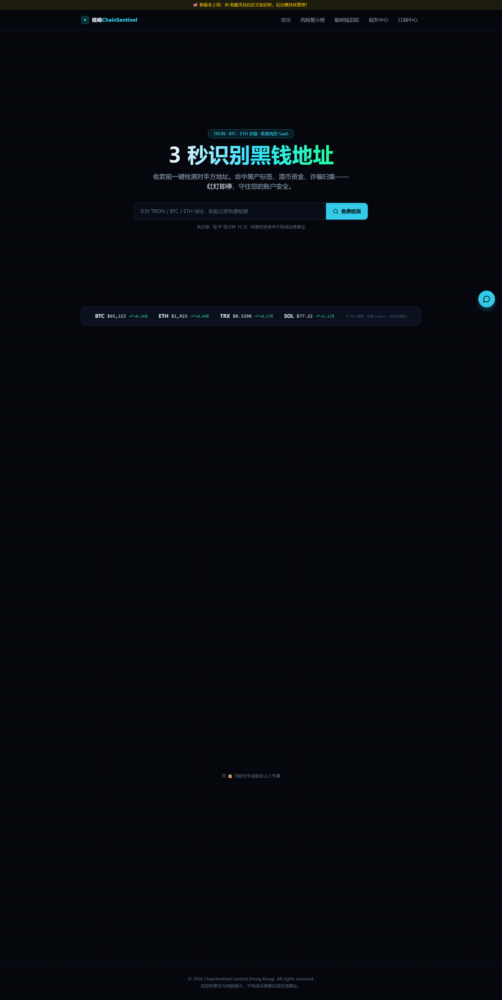
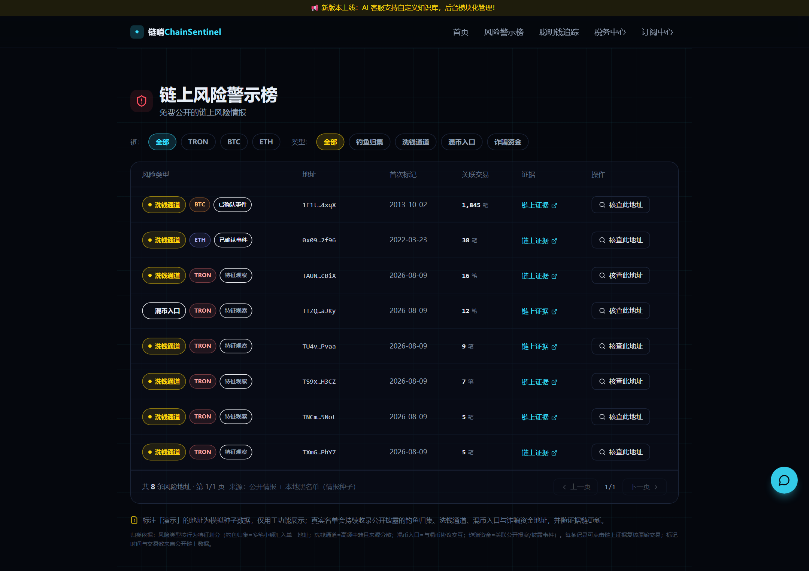
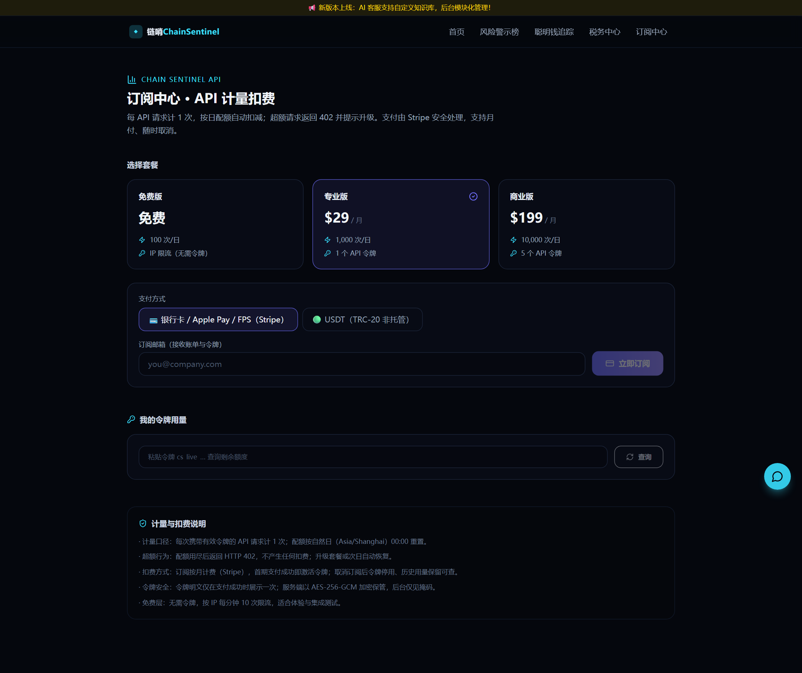

<div align="center">

# ◆ ChainSentinel 链哨

### 链上风控 KYT 引擎 · 3 秒识别黑钱地址

多链地址风险筛查（TRON / BTC / ETH）· OFAC 制裁名单 · 香港税务核算 · 可商用开源底座

[](LICENSE)


[](https://github.com/like96555-boop/chainsentinel)

**地址粘贴即查 · 红绿灯结论 + 链上证据直达区块浏览器 · 数据来源全透明 · 支持 Stripe / USDT 收款**

[快速开始](#-快速开始) · [界面预览](#-界面预览) · [功能特性](#-功能特性) · [API 示例](#-api-示例) · [开源 vs 商业版](#-开源-vs-商业版) · [数据源](#-数据源与合规)

</div>

---

## ✦ 为什么用 ChainSentinel

| 你担心的事 | ChainSentinel 的答案 |
|---|---|
| 😰 收到黑钱地址，资金被冻 | **3 秒红绿灯结论**，附链上证据链接，可复核可留档 |
| 😰 合规筛查太贵 | **OFAC 制裁名单 900+ 地址免费内置**，零节点成本架构 |
| 😰 数据来源说不清 | 每条结论标注来源：官方制裁名单 / 执法记录 / 特征观察，全透明 |
| 😰 虚拟资产税务算不清 | 香港口径 FIFO/LIFO/HIFO + DIPN 59 / Cap.112 法律映射，审计联动 |
| 😰 客户付不了款 | 支持 **Stripe 卡/Apple Pay/FPS + USDT（TRC-20 非托管）** 双通道 |

## ✦ 界面预览

| 地址风险查询（3 秒红绿灯） | 链上风险警示榜（分级透明） |
|:---:|:---:|
|  |  |

| API 订阅中心（计量扣费 + USDT/Stripe 双支付） |
|:---:|
|  |

> 全部功能真实可运行：克隆仓库 → `npm run build && npm start` → 打开 <http://localhost:3000> 即刻体验。

## ✦ 功能特性

| 模块 | 说明 |
|---|---|
| 🔍 **多链地址风控查询** | TRON / BTC / ETH 自动识别，无需选择；红绿灯结论 + 风险评分 + 原因 + 证据链接 |
| 🚫 **OFAC 制裁名单** | 内置 900+ 美国财政部 SDN 制裁地址（TRON 188 / BTC 524 / ETH 96），官方公开数据、每日可同步 |
| 📢 **链上风险警示榜** | 公开风险情报榜：已确认事件（执法/安全记录）与特征观察分级展示，来源徽章透明标注 |
| 💰 **聪明钱追踪** | 机构/巨鲸地址实时链上数据 + 关注标 K 线（lightweight-charts），Feature Gate 灰度 |
| 🧮 **香港税务中心** | FIFO / LIFO / HIFO 三成本法核算，映射 DIPN 59 / Cap.112 法律条文，黑名单对手方自动审计联动 |
| 🤖 **AI 客服** | Kimi 流式对话，配置后台可视化（独立部署单元），未配置时优雅降级 |
| 🔑 **API 计量扣费** | 令牌即计量单位：按日配额扣减、超额 402；**Stripe 订阅 + USDT（TRC-20 非托管）双支付通道**，后台可视化维护套餐与收款地址 |
| 🛡️ **安全架构** | AES-256-GCM 密钥加密落盘 · HMAC Cookie 会话 · zod 全接口校验 · 内存限流 · 安全响应头 |

## ✦ 快速开始

```bash
# 1) 克隆
git clone https://github.com/like96555-boop/chainsentinel.git
cd chainsentinel

# 2) 安装依赖（国内建议 npmmirror 镜像）
npm ci --registry=https://registry.npmmirror.com

# 3) 启动（首次自动生成 MASTER_KEY 并写入 .env）
npm run build && npm start
# 打开 http://localhost:3000 —— 粘一个地址试试
```

管理后台：`http://localhost:3000/admin`（密码在 `.env` 的 `ADMIN_PASSWORD`）。
订阅中心：`http://localhost:3000/dashboard`（API 计量扣费自助；本地演示需显式 `STRIPE_MOCK=1`，生产模式未配密钥时订阅接口返回 503 明确报错，不会静默放行）。

## ✦ API 示例

```bash
# 地址风险查询（免费层：无需令牌，按 IP 限流）
curl -X POST http://localhost:3000/api/check \
  -H "Content-Type: application/json" \
  -d '{"address":"0x098B716B8Aaf21512996dC57EB0615e2383E2f96"}'
# → {"level":"red","score":5,"reasons":["命中本地风险标签库：Ronin Bridge 攻击事件归集地址（2022-03）",...]}

# 订阅后（Bearer 令牌）按日配额计量，超额返回 402
curl -X POST http://localhost:3000/api/check \
  -H "Authorization: Bearer cs_live_xxxx" \
  -H "Content-Type: application/json" \
  -d '{"address":"TNiq9AXBp9EjUqhDhrwrfvAA8U3GUQZH81"}'
# → {"level":"red",...,"blacklist":{"source":"ofac-sdn","sourceLabel":"美国财政部 OFAC 制裁名单（官方公开数据）"}}
```

## ✦ 开源 vs 商业版

| | 社区版（本仓库） | 专业版（SaaS） | 商业版（SaaS） |
|---|---|---|---|
| 多链地址查询 | ✅ 免费（IP 限流） | ✅ 1000 次/日 | ✅ 10000 次/日 |
| OFAC 制裁名单 | ✅ | ✅ | ✅ |
| 风险警示榜 | ✅ | ✅ | ✅ |
| API 令牌与计量 | ✅ 基础 | ✅ | ✅ 5 令牌 |
| 聪明钱追踪 Pro | 🔒 锁态演示 | ✅ | ✅ |
| 税务中心 Pro | 🔒 锁态演示 | ✅ | ✅ |
| 定价 | 免费 | $29 / 月 | $199 / 月 |
| 商用授权 | GPL-3.0 开源协议 | 订阅即授权 | 订阅即授权 |

> GPL-3.0：本仓库代码可自由使用/修改，**闭源商用须遵守 GPL 或购买商业授权**。专业版/商业版为托管 SaaS，不含闭源代码。

## ✦ 数据源与合规

- **OFAC SDN 制裁名单**：美国财政部官方公开数据（Public Domain），经 `vile/ofac-sdn-list` 每日同步镜像分发，`node scripts/intel-sync.mjs ofac` 一键入库（含本地缓存兜底）。
- **链上原始数据**：TronGrid / Blockstream / 公共 RPC，零节点成本。
- **链上启发式**：自产自销的特征观察（真实地址，非官方定性），仅作提示不进红牌。
- **风控分级纪律**：红牌结论只由已确认事件（执法/安全记录、官方制裁名单）支撑；特征观察明确标注「非官方定性」。
- 风控结果为风险提示，不构成法律意见或投资建议。

## ✦ 测试

```bash
npm test            # 回归 14 + 安全 16 + 压测
npm run tax:test    # 税务中心 17（FIFO/LIFO/HIFO + 审计联动）
node scripts/intel-test.mjs    # 情报源 12（含 OFAC 同步/红牌/来源标注）
node scripts/billing-test.mjs  # 计量扣费 33（含 USDT 非托管收款；服务以 STRIPE_MOCK=1 启动）
```

## ✦ 支持与商业合作

**开源免费、商用双轨** —— 你的每一次使用都在帮助链哨成长：

- ⭐ **Star 本项目**：让更多需要链上风控的人找到它
- 🐛 **提 Issue / PR**：一起把 KYT 做得更准
- ☕ **GitHub Sponsors 赞助**：<https://github.com/sponsors>（个人开发者维护不易）
- 💼 **专业版订阅**（托管 SaaS）：$29/月 —— 免部署、每日制裁名单自动更新、API 高配额
- 🏢 **商业授权**：GPL 闭源商用合规、定制部署、合规落地陪跑
- 📮 **联系**：GitHub Issues / 仓库作者邮箱

> 你的 Star 是开源项目最大的动力。**用起来，就是最好的支持。**

## ✦ 免责声明

本软件为链上数据分析工具，输出仅为风险提示，不构成法律意见、投资建议或金融建议。使用者应独立核验并遵守所在地法律法规。© 2026 ChainSentinel Limited (Hong Kong)
